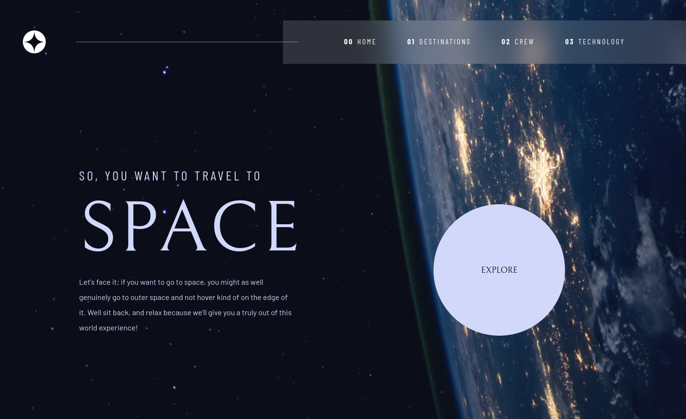

# Frontend Mentor - Space tourism website solution

This is a solution to the [Space tourism website challenge on Frontend Mentor](https://www.frontendmentor.io/challenges/space-tourism-multipage-website-gRWj1URZ3). Frontend Mentor challenges help you improve your coding skills by building realistic projects.

## Table of contents

- [Overview](#overview)
  - [The challenge](#the-challenge)
  - [Screenshot](#screenshot)
  - [Links](#links)
- [My process](#my-process)
  - [Motivation](#motivation)
  - [Built with](#built-with)
  - [What I learned](#what-i-learned)
  - [Continued development](#continued-development)
  - [Useful resources](#useful-resources)
  - [Useful tools](#useful-tools)
- [Author](#author)
- [Acknowledgments](#acknowledgments)

## Overview

### The challenge

Users should be able to:

- View the optimal layout for each of the website's pages depending on their device's screen size
- See hover states for all interactive elements on the page
- View each page and be able to toggle between the tabs to see new information

### Screenshot



### Links

- Solution URL: [Github](https://github.com/eugenekulikou/space-tourism-nuxt3-tailwind)
- Live Site URL: [https://space-tourism-nuxt-tailwind.vercel.app/](https://space-tourism-nuxt-tailwind.vercel.app/)

## My process

### Motivation

My motivation is twofold: firstly, to explore the capabilities of Nuxt3 for static site generation and secondly, to enhance my overall web development skills. I am driven to achieve mastery in pixel-perfect design and to implement Tailwind's DRY (Don't Repeat Yourself) best practices, thereby creating a design system with easily readable and maintainable classes.

In this project, I'm diving into Nuxt3 to construct a content-based multi-page website, which can be generated as a static site.

My objective is to attain a Light House score exceeding 99, coupled with impeccable Core Web Vitals statistics. The application will seamlessly connect to a CRM API or utilize plain markdown, facilitating edits by non-engineer staff. Leveraging robust @nuxt3 modules, including those for SEO, i18n, Nuxt Images, and social share previews, is central to my approach. Furthermore, I will integrate transitions and animations, providing rationale for each design choice.

Furthermore, I am committed to exploring the boundaries of deployment options beyond Vercel, seeking alternative hosts to broaden my understanding of deployment strategies of Nuxt3.

### Built with

- Semantic HTML5 markup
- CSS Grid Templates
- Mobile-first workflow
- [Nuxt3](https://nuxt.com/) - Vue Framework
- [Nuxt/Image](https://image.nuxt.com/) - Optimized Images for Nuxt Apps
- [Nuxt/Seo](https://www.nuxtseo.com/) - SEO work for Nuxt
- [TailwindCSS](https://tailwindcss.com/) - A utility-first CSS framework
- Typescript
- ESlint & Prettier

<!-- ### What I learned

Use this section to recap over some of your major learnings while working through this project. Writing these out and providing code samples of areas you want to highlight is a great way to reinforce your own knowledge.

To see how you can add code snippets, see below:

```html
<h1>Some HTML code I'm proud of</h1>
```

```css
.proud-of-this-css {
  color: papayawhip;
}
```

```js
const proudOfThisFunc = () => {
  console.log('🎉');
};
``` -->

### Continued development

In future, I aim to achieve a 99 accessibility score and implement robust internationalization support while continuously refining techniques and staying updated on best practices in both areas to create inclusive and user-friendly experiences for a diverse global audience.

### Useful resources

- [Grid Template](https://css-tricks.com/almanac/properties/g/grid-template/) - CSS grid templates simplify the creation of complex grid layouts by allowing the concise definition of grid columns, rows, and areas in a single declaration.
- [Cached Fetch Composable](https://masteringnuxt.com/blog/writing-a-cache-composable-in-nuxt-3) - Caching is a great way to save hosting service bill.

### Useful tools

- [perfectpixel](https://www.welldonecode.com/perfectpixel/) - A great tool to developing website with per-pixel accuracy.
- [unlighthouse](https://unlighthouse.dev/) - Unlighthouse is a tool to scan your entire site with Google Lighthouse in 2 minutes (on average). Open source, fully configurable with minimal setup.

## Author

- Frontend Mentor - [@eugenekulikou](https://www.frontendmentor.io/profile/eugenekulikou)
- LinkedIn - [@eugenekulikou](https://www.linkedin.com/in/eugenekulikou/)

<!-- ## Acknowledgments

This is where you can give a hat tip to anyone who helped you out on this project. Perhaps you worked in a team or got some inspiration from someone else's solution. This is the perfect place to give them some credit.

**Note: Delete this note and edit this section's content as necessary. If you completed this challenge by yourself, feel free to delete this section entirely.** -->
